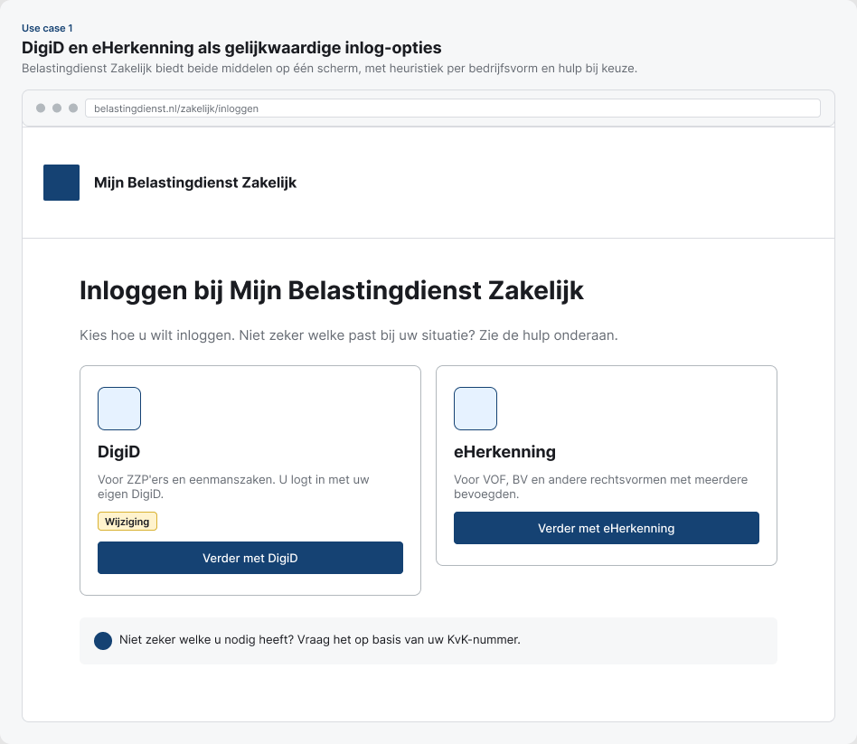
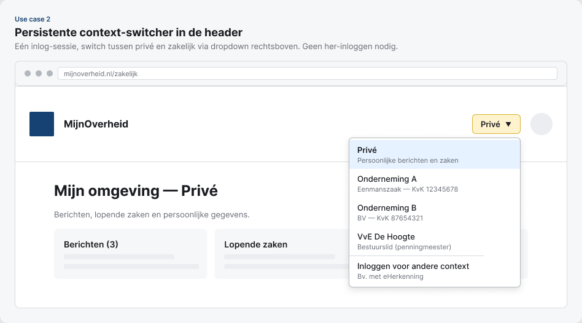
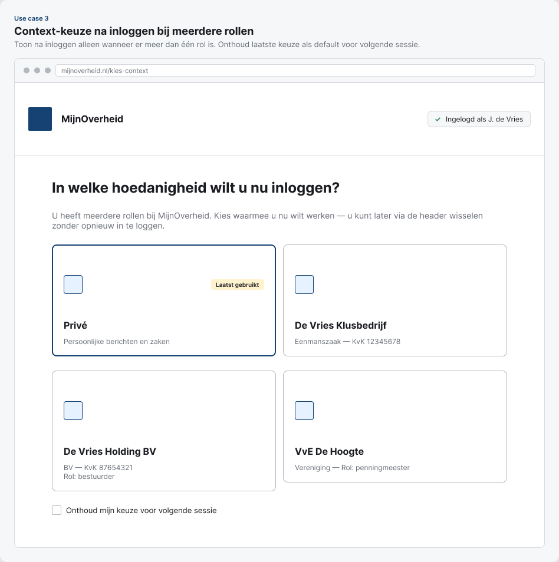
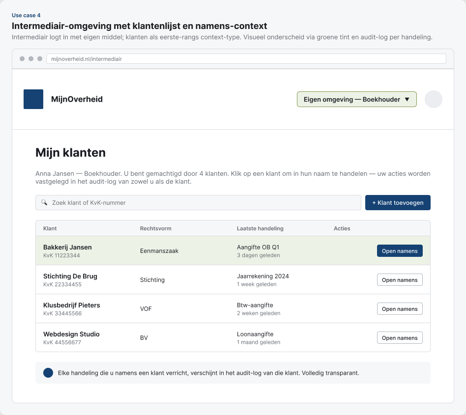
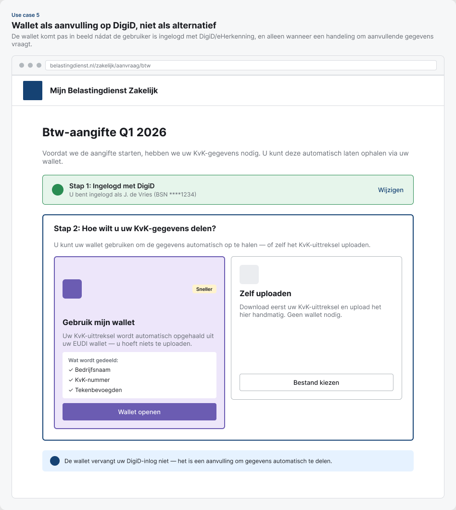
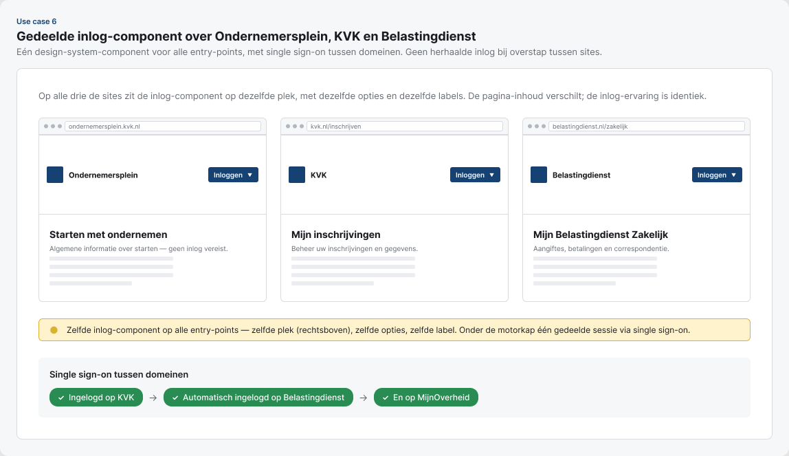

## Samenvatting

Op basis van de [deskresearch inloggen](moza-pi2-deskresearch-inloggen.qmd) lopen ondernemers, burgers en intermediairs vast op vijf terugkerende pijnpunten: *versnipperde entry-points*, *eHerkenning als barrière voor kleine ondernemers*, *een wallet die wordt verward met een inlogmiddel*, *het ontbreken van een snelle context-switch* en *een twee-laags machtigingsstroom die nu niet als één flow is ontworpen*.

Dit rapport vertaalt die bevindingen naar zes concrete aanbevelingen, één per dominante use-case. Per use-case beschrijven we het probleem (met directe gebruikersquotes uit de deskresearch), de aanbeveling, een flow-chart en een wireframe-schets.

::: {.callout-tip title="Belangrijkste bevinding"}
De kern van vrijwel alle pijnpunten is dat het inlog-middel (wíé ben je) en de rol-/context-keuze (in welke hoedanigheid handel je) op dit moment **door elkaar lopen**. De aanbeveling is om die twee lagen consequent te scheiden, zowel in de UI als in de architectuur — en om de context-switch ná het inloggen persistent en zichtbaar te maken in plaats van een nieuwe inlog-flow te vereisen.
:::

## Uitgangspunten

Vijf principes die de aanbevelingen onderbouwen — afgeleid uit de deskresearch:

1. **Inloggen op het juiste moment.** Pas om inloggen vragen wanneer een gebruiker een handeling wil verrichten, niet bij informeren. Bron: *"Als ik gewoon aan het informeren ben, zou ik niet meteen inloggen…"* — Prototype Interview 23.
2. **Inlog-middel ≠ rol.** Scheid het identiteits-middel (DigiD, eHerkenning, wallet) van de rol/context (privé, onderneming A, onderneming B, namens klant). De wallet werd in onderzoek consequent verward met een vervangend inlogmiddel.
3. **Eén inlog-component, meerdere entry-points.** Ondernemersplein, KVK, Belastingdienst en MijnOverheid mogen verschillende landingspagina's hebben, maar de inlog-keuze zelf moet identiek zijn — visueel, qua opties en qua afhandeling.
4. **Context-switch in plaats van her-inloggen.** Wanneer een ingelogde gebruiker meerdere contexten heeft (privé, onderneming, namens klant), wissel je via een persistente header-component, niet via uitloggen en opnieuw inloggen.
5. **Begeleid het ongebruikelijke pad, niet het gewone.** De meeste DigiD-gebruikers loggen probleemloos in. Ontwerp-aandacht moet naar de afwijkende paden: eHerkenning-gewenden die overstappen, ZZP'ers die in een eHerkenning-flow belanden, intermediairs en buitenlandse ondernemers.

## Architectuur op hoofdlijnen

Voorgestelde scheiding tussen entry-points, identiteits-middel en context-laag:

```{mermaid}
%%{init: {'flowchart': {'defaultRenderer': 'elk'}}}%%
graph LR
  subgraph entry [Entry-points]
    direction TB
    EP1[Ondernemersplein]
    EP2[KVK]
    EP3[Belastingdienst]
    EP4[Overheid.nl / MijnOverheid]
  end

  IC["Uniforme inlog-component<br/>(zelfde keuzes, zelfde UI)"]

  subgraph middel [Identiteits-middel]
    direction TB
    M1[DigiD]
    M2[eHerkenning]
    M3[EUDI Wallet]
    M4[Machtiging<br/>namens klant]
  end

  subgraph context [Context na inloggen]
    direction TB
    C1[Privé]
    C2[Onderneming A]
    C3[Onderneming B]
    C4[Klant X<br/>namens-rol]
  end

  EP1 --> IC
  EP2 --> IC
  EP3 --> IC
  EP4 --> IC
  IC --> M1
  IC --> M2
  IC --> M3
  IC --> M4
  M1 --> C1
  M1 --> C2
  M2 --> C2
  M2 --> C3
  M3 --> C1
  M3 --> C2
  M4 --> C4
  C1 <--> C2
  C2 <--> C3
  C3 <--> C4

  style entry fill:transparent,stroke:#bbb,stroke-dasharray:3 3
  style middel fill:transparent,stroke:#bbb,stroke-dasharray:3 3
  style context fill:transparent,stroke:#bbb,stroke-dasharray:3 3
```

De drie lagen — **entry**, **middel** en **context** — moeten in alle scenarios onafhankelijk van elkaar werken. Een ondernemer kan vanaf KVK starten, inloggen met DigiD, en switchen tussen privé en zijn eenmanszaak zonder uit te loggen. Een intermediair kan vanaf Belastingdienst Zakelijk starten, inloggen met eHerkenning, en switchen tussen vier klanten — opnieuw zonder her-inloggen.

---

## Use case 1 — ZZP/eenmanszaak met alleen DigiD

### Probleem

ZZP'ers en eenmanszaken hebben vaak alleen DigiD en lopen vast als eHerkenning impliciet wordt verondersteld. Tegelijk weet niet iedereen wat zijn juridische bedrijfsvorm betekent voor de keuze.

::: {.callout-note title="Prototype Interview 4, ZZP'er"}
"En waarom moet ik elke keer met die E-Herkenning inloggen? Ik doe dat met DigiD."
:::

Uit de Belastingdienst-test bleek bovendien dat ZZP'ers die in een DigiD-flow zitten, zich identificeren via "eenmanszaak" of via "volledige tekenbevoegdheid" — de laatste optie werd als negatief geframed beleefd: *"ik ben geen zzp'er of eenmanszaak, dus ik moet dit kiezen."*

### Aanbeveling

- Toon DigiD én eHerkenning als gelijkwaardige opties op het inlog-scherm, met een korte heuristiek erbij ("DigiD voor ZZP en eenmanszaak", "eHerkenning voor VOF, BV en groter").
- Vraag bij DigiD-inlog daarná in welke rol je handelt (privé, eenmanszaak X, …) in plaats van vooraf één pad af te dwingen.
- Vermijd in rol-lijsten dubbel-negatieve labels ("volledige tekenbevoegdheid" als enige restcategorie). Gebruik herkenbare bedrijfsvormen en bied "Geen van bovenstaande — uitleg" als expliciete afsplitsing.

### Flow

```{mermaid}
%%{init: {'flowchart': {'defaultRenderer': 'elk'}}}%%
graph LR
  S[Start: handeling op<br/>Belastingdienst Zakelijk] --> L[Inlog-component]
  L --> K{Keuze middel}
  K -->|DigiD| D[DigiD-inlog]
  K -->|eHerkenning| E[eHerkenning-inlog]
  D --> R{Rol-keuze<br/>na inlog}
  R -->|Privé| P[Privé-omgeving]
  R -->|Eenmanszaak / ZZP| EM[Zakelijk:<br/>Eenmanszaak]
  R -->|Andere bedrijfsvorm| H[Uitleg + verwijzing<br/>naar eHerkenning]
  E --> Z[Zakelijk:<br/>rechtsvorm uit eHerkenning]
```

### Wireframe



---

## Use case 2 — Snel switchen tussen privé en zakelijk

### Probleem

Ondernemers willen in één sessie wisselen tussen privé en zakelijk zonder uit te loggen. De huidige flow vereist vaak een nieuwe inlog of zelfs een ander portaal.

::: {.callout-note title="MKB 10-25, sessie 4"}
"MijnOverheid als startpunt, waar ik vanuit 1 inlog, 1 website en 1 click aan de slag kan."
:::

Tegelijk wil een meerderheid de privé- en zakelijke data wél visueel gescheiden houden: 55% van ondernemers met een bestuursfunctie wil gegevens gescheiden zien (KVK-enquête, n=400).

### Aanbeveling

- Plaats een **persistente context-switcher** in de header (rechtsboven, naast het profielicoon) die zichtbaar toont in welke context je nu zit.
- Behoud één inlog-sessie; de switch verandert alleen de getoonde gegevens, niet de identiteit.
- Maak de scheiding visueel: andere achtergrondkleur of subtiel label per context, zodat de gebruiker altijd weet "ik ben nu zakelijk bezig met Onderneming A".

### Flow

```{mermaid}
%%{init: {'flowchart': {'defaultRenderer': 'elk'}}}%%
graph LR
  L[Inlog<br/>één sessie] --> H[Header met<br/>context-switcher]
  H --> P[Privé-omgeving]
  H --> A[Zakelijk:<br/>Onderneming A]
  P -->|switch via header| A
  A -->|switch via header| P
```

### Wireframe



---

## Use case 3 — Meerdere ondernemingen of bestuursrollen

### Probleem

Een groeiende groep ondernemers heeft meerdere rollen: ZZP'er + bestuurder bij een vereniging, of meerdere ondernemingen, of ondernemer + VvE-penningmeester. Bestuursleden van verenigingen en stichtingen zijn bovendien vaak vrijwilligers en wisselen regelmatig, waardoor procedurele kennis ontbreekt.

::: {.callout-note title="MKB<10, sessie 2"}
"Ik heb behoefte aan een vast aanspreekpunt binnen de overheid voor ondernemerszaken."
:::

### Aanbeveling

- Toon na inloggen een **lijst van beschikbare contexten** wanneer de gebruiker er meer dan één heeft (privé, onderneming A, onderneming B, bestuursrol X).
- Bewaar de **laatst-gebruikte context** als default bij een volgende sessie.
- Onthoud expliciet machtigingen/rollen die de gebruiker via KvK heeft, zodat er geen extra koppel-stappen nodig zijn na inloggen met eHerkenning.
- Toon **wat de context inhoudt**: bij een bestuursrol expliciet welke rechten erbij horen (penningmeester ≠ voorzitter).

### Flow

```{mermaid}
%%{init: {'flowchart': {'defaultRenderer': 'elk'}}}%%
graph LR
  L[Inlog gelukt] --> M{Aantal<br/>contexten?}
  M -->|1| D1[Direct naar<br/>die context]
  M -->|meerdere| K[Toon context-keuze:<br/>privé, onderneming A,<br/>onderneming B,<br/>bestuur VvE …]
  K --> S[Switcher blijft<br/>zichtbaar in header]
  S --> X[Geselecteerde<br/>context]
  X -->|switch| S
```

### Wireframe



---

## Use case 4 — Intermediair logt in namens klant

### Probleem

Boekhouders, accountants en juridisch dienstverleners moeten namens hun klanten handelen. De huidige flow dwingt eerst eigen inlog, dan losse klant-keuze, en is vaak portaal-specifiek ingericht.

::: {.callout-note title="Behoefte intermediairs (deskresearch)"}
- Digitaal dossier met instelbare machtigingen
- Toegang tot systemen en producten van organisaties
- Driehoeksverhouding tussen klant, intermediair en overheidsorganisaties
- Gelijkwaardige samenwerking en transparantie
:::

### Aanbeveling

- Behandel "namens-rol" als een **eerste-rangs context-type**, net als privé en zakelijk. De switcher in de header toont ook de klanten waarvoor je gemachtigd bent.
- Toon altijd duidelijk in welke namens-context je nu handelt — met andere bandering/kleur dan eigen contexten, om vergissingen te voorkomen.
- Maak machtigingen-beheer voor de klant transparant: de klant ziet welke intermediair welke rechten heeft en kan dit per dienst/scope intrekken.
- Logging: elke namens-handeling moet in het audit-logboek bij zowel intermediair als klant zichtbaar zijn.

### Flow

```{mermaid}
%%{init: {'flowchart': {'defaultRenderer': 'elk'}}}%%
graph LR
  I[Intermediair logt<br/>in met eigen middel<br/>DigiD/eHerkenning] --> O[Eigen omgeving<br/>+ klantenlijst]
  O --> K[Kies klant X]
  K --> N[Namens-context X<br/>visueel onderscheiden]
  N -->|switch klant| O
  N -->|switch privé/eigen| O
  N --> A[Audit-log<br/>elke handeling]
```

### Wireframe



---

## Use case 5 — Wallet als aanvullend identiteits-middel

### Probleem

In de Belastingdienst-test koos een deel van de deelnemers de wallet *omdat het "makkelijker gegevens delen" beloofde*, en interpreteerde dit als een alternatief voor DigiD/eHerkenning — niet als aanvulling. Daardoor mislukte de inlog of werd er gekozen voor een middel dat niet bij hun bedrijfsvorm past.

::: {.callout-note title="Onderzoeksvraag deskresearch"}
"Begrijpt men wat een wallet is en dat je dit altijd naast je gewone inlog kan gebruiken?"
:::

### Aanbeveling

- Positioneer de wallet **niet als derde naast-middel** in de inlog-keuze, maar als **uitbreiding** op DigiD of eHerkenning. Visueel: na keuze van DigiD/eHerkenning de optie "Gebruik wallet voor automatisch gegevens delen".
- Leg in één zin uit wat de wallet *toevoegt* in de context van de huidige handeling ("met wallet hoef je KvK-uittreksel niet handmatig te uploaden").
- Bied wallet alleen aan in flows waarin het ook echt nut heeft (gegevens delen, attestaties). Niet bij elke inlog standaard tonen.

### Flow

```{mermaid}
%%{init: {'flowchart': {'defaultRenderer': 'elk'}}}%%
graph LR
  L[Inlog-component] --> K{Middel?}
  K -->|DigiD| D[DigiD-inlog]
  K -->|eHerkenning| E[eHerkenning-inlog]
  D --> W{Handeling vraagt<br/>extra gegevens?}
  E --> W
  W -->|Ja| WK[Aanbieden:<br/>'Wallet gebruiken<br/>voor automatisch delen']
  W -->|Nee| C[Door naar context]
  WK -->|Akkoord| WG[Wallet deelt gegevens]
  WK -->|Skip| C
  WG --> C
```

### Wireframe



---

## Use case 6 — Eenduidige entry over Ondernemersplein, KVK, Belastingdienst en MijnOverheid

### Probleem

Gebruikers ervaren de overheid als versnipperd. Verschillende sites tonen verschillende inlog-componenten, op andere plekken op de pagina, met andere labels.

::: {.callout-note title="Ondernemer, MKB 10–50"}
"De overheid is zo ontzettend versnipperd. Pak er één plek of platform uit en maak dat het gewoon. Breng alle overheden bij elkaar."
:::

Daarbovenop: vrijwel alle respondenten in de Belastingdienst-test gebruikten niet de inlogknop rechtsboven, maar bookmarks of links. Een aanwijzing dat de "officiële" entry niet vindbaar of niet vertrouwd is.

### Aanbeveling

- Implementeer een **gedeelde inlog-component** als design-system-element. Visueel en gedragsmatig identiek op Ondernemersplein, KVK, Belastingdienst en MijnOverheid.
- Standaardiseer **plaats**: rechtsboven én een prominente CTA in-page bij call-to-action handelingen.
- Voor wie binnenkomt zonder login (informatie-modus): geen verplichte inlog, wel een zichtbare maar terughoudende prompt op het moment dat een handeling om inlog vraagt.
- Bij vertrek vanaf de ene context (bv. KVK-uittreksel) naar de andere (bv. Belastingdienst-aangifte): behoud de sessie via single-sign-on, zodat er niet opnieuw moet worden ingelogd.

### Flow

```{mermaid}
%%{init: {'flowchart': {'defaultRenderer': 'elk'}}}%%
graph LR
  subgraph entries [Verschillende entry-points]
    direction TB
    EP1[Ondernemersplein]
    EP2[KVK]
    EP3[Belastingdienst]
    EP4[MijnOverheid]
  end

  IC["Gedeelde inlog-component<br/>(zelfde plaats, zelfde UI)"]
  SSO[Single sign-on<br/>tussen domeinen]
  EX[Geselecteerde<br/>handeling]

  EP1 --> IC
  EP2 --> IC
  EP3 --> IC
  EP4 --> IC
  IC --> SSO
  SSO --> EX
  EX -->|naar ander domein| SSO

  style entries fill:transparent,stroke:#bbb,stroke-dasharray:3 3
```

### Wireframe



---

## Wireframes {#wireframes}

De zes wireframes hierboven zijn uitgewerkt in een gedeeld Figma-bestand: [MOZa — Wireframes Aanbevelingen Inloggen](https://www.figma.com/design/CccigG5viJxGyIhpBsMdhy). Daar staan ze in originele resolutie en blijven ze het uitgangspunt voor verdere iteratie. De afbeeldingen in dit rapport zijn momentopnames; bij wijzigingen in Figma worden ze hier handmatig vervangen.

## Vervolgonderzoek

- **Validatie via prototype-test**: bouw één high-fidelity prototype van de context-switcher (UC2 + UC3) en test met ondernemers met meerdere rollen.
- **A/B test op heuristiek-tekst** (UC1): meet of de korte uitleg bij DigiD/eHerkenning ZZP'ers vaker naar de juiste keuze leidt.
- **Intermediair-co-creatie** (UC4): organiseer een sessie met boekhouders en accountants om de namens-context UI te toetsen.
- **Wallet-begrip** (UC5): hertest na implementatie of gebruikers de wallet nu correct interpreteren als uitbreiding, niet als alternatief.
- **Cross-domein gedrag** (UC6): meet hoe vaak gebruikers daadwerkelijk single sign-on benutten tussen KVK, Belastingdienst en MijnOverheid in een typische sessie.

## Bronnen

- [MOZa - PI2 Deskresearch Inloggen](moza-pi2-deskresearch-inloggen.qmd) — primaire bron voor alle quotes en bevindingen
- KvK-enquête 2023 onder 400 ondernemers en bestuursleden (besproken in de deskresearch)
- Belastingdienst gebruikerstest Inloggen met DigiD (scenario's A, B, D, E)
