## Zeewaardig onderzoek

::: {.callout-quote title="Citaat Ondernemer, MKB 10–50 medewerkers"}
De overheid is zo ontzettend versnipperd. Pak er één plek of platform uit en maak dat het gewoon. Breng alle overheden bij elkaar.
:::

### Waardering functionaliteit

Inloggen op het juiste moment; inloggen wanneer nodig, bijvoorbeeld bij het zoeken van meer relevante info of het daadwerkelijk indienen van een aanvraag.

::: {.callout-quote title="Citaat Prototype Interview 23, MKB 10-50"}
Als ik gewoon aan het informeren ben, zou ik niet meteen inloggen… Als ik het echt wil aanvragen, dan zou ik wel inloggen…
:::

### Dit wordt nog gemist als functionaliteit

Toegankelijkheid bij eHerkenning. Niet alle ondernemers hebben overheidsorganisaties eHerkenning, waardoor de toegankelijke doelgroep beperkter is.

::: {.callout-quote title="Citaat Prototype Interview 4, ZZP’er"}
En waarom moet ik elke keer met die E-Herkenning inloggen? Ik doe dat met DigiD.
:::

### Wat ervaren ondernemers als positief

Kunnen inloggen met eHerkenning uit naam van bedrijf i.p.v. privé. 

Intermediairs willen op een digitaal dossier kunnen inloggen. Inloggen met code van de klant (DigiD, e-herkenning).

Hun behoeftes:

- digitaal dossier met instelbare machtigingen; 
- mogelijkheid voor organisaties om signaleringen te doen; 
- toegang tot systemen en producten van organisaties;
- Een driehoeksverhouding tussen klant, intermediair en overheidsorganisaties; 
- Gelijkwaardige samenwerking en transparantie;

Mkb’ers (10-25) hebben dit als input gegeven bij een co-creatiesessie: één inlog Centraal digitaal loket

### Co-creatiesessie met starters

Toegang vanaf overal (thuis, vakantie) door eenmalig inloggen

- toekomstgerichte en positieve ervaring
- samenwerking tussen Belastingdienst en ondernemers

### Ondernemers willen:

Eenvoudig en veilig inloggen: Eén keer inloggen voor toegang tot alle diensten, veilige plek voor documenten.

::: {.callout-quote title="Citaat ZZP-er, sessie 1"}
Ik wil makkelijk bij mijn omgeving kunnen komen en kunnen inloggen.
:::

Vast aanspreekpunt: één keer inloggen voor toegang tot alle diensten, veilige plek voor documenten.

::: {.callout-quote title="Citaat MKB<10, sessie 2"}
Ik heb behoefte aan een vast aanspreekpunt binnen de overheid voor ondernemerszaken.
:::

Eén keer inloggen: Eén inlog, één website en één klik om toegang te krijgen tot alle diensten, evt. met MijnOverheid als startpunt.

::: {.callout-quote title="Citaat MKB 10-25, sessie 4"}
MijnOverheid als startpunt, waar ik vanuit 1 inlog, 1 website en 1 click aan de slag kan.
:::

Gemakkelijk startpunt: Eenvoudige toegang, bijvoorbeeld via een QR-code.

::: {.callout-quote title="Citaat ZZP-er, sessie 1"}
Een makkelijk startpunt waar ik niet lang naar hoef te zoeken en mij doorverwijst naar de omgeving waar ik moet inloggen, zoals bijvoorbeeld een QR code.
:::

### Filteren op uw situatie

Ondernemers konden in het prototype inloggen om op basis van de beschikbare in het profiel van MijnOnderneming een overzicht van subsidies te laten filteren op basis van hun situatie.

### KVK data delen

Ondernemers konden via een knop en inlog de gegevens van het KVK uittreksel ophalen zonder dit document te moeten downloaden en ophalen.

### Goede punten uit het prototype

Inloggen op het juiste moment. Alleen inloggen wanneer nodig, bijvoorbeeld bij het daadwerkelijk indienen van een aanvraag.

::: {.callout-quote title="Citaat Prototype Interview 23, ZZP’er"}
Als ik gewoon aan het informeren ben, zou ik niet meteen inloggen…
:::

Niet alle ondernemers hebben eHerkenning.

::: {.callout-quote title="Citaat ZZP-er, sessie 1"}
En waarom moet ik elke keer met die E-Herkenning inloggen? Ik doe dat met DigiD
:::

### Aansluiten op bestaande publieke platforms

Sluit aan op wat mensen al kennen en gebruiken, zoals bestaande websites en processen in plaats van alles opnieuw te ontwerpen.

### Soort ‘driehoeksrelatie’ tussen overheid, ondernemer en intermediair

### Use cases

::: {.callout-usecase title="Use case 1"}
Burger wilt snel naar persoonlijke omgeving (MO), klikt vanaf overheid.nl naar MijnOverheid Zakelijk CTA, ontvangt ‘*herstelroute*’.
:::

::: {.callout-usecase title="Use case 2"}
Ondernemer zoekt startpagina voor zakelijke zaken, komt op overheid.nl en zoekt naar zijn zakelijke omgeving.
:::

::: {.callout-usecase title="Use case 3"}
Ondernemer heeft alleen DigiD, maar ziet eHerkenning als standaard “Waarom moet ik elke keer met eHerkenning inloggen?”
:::

::: {.callout-usecase title="Use case 4"}
Ondernemer ziet meerdere ‘*inlogdeuren*’ maar snapt niet welke deur hij voor welke zaken dient te gebruiken.
:::

::: {.callout-usecase title="Use case 5"}
Intermediair moet inloggen namens bedrijf, moet inloggen en machtigen door ondernemer; twee-laags authenticatie.
:::

::: {.callout-usecase title="Use case 6"}
Ondernemer in het buitenland wilt inloggen op MijnOverheid Zakelijk
:::

---

## Belastingdienst onderzoek inlog-flow

### Centrale onderzoeksvraag

Gegeven het feit dat er verschillende rollen (zelf, zzp, eenmanszaak, bedrijf, organisatie + fiscale eenheid en zelfstandig bevoegd bestuurder) zijn, biedt de opbouw van het inlogscherm (ook via de digitale wallet) dan voor alle doelgroepen (burgers, ondernemers en intermediairs; zonder voorkennis) voldoende duidelijkheid om op intuïtieve wijze makkelijk en correct in te loggen  in de omgevingen van de Belastingdienst?

### Deelvragen

1. Is het begin van de klantreis logisch, dus vanaf de keuze van het juiste portaal?
2. Zijn de labels voor de gebruikte rollen duidelijk, herkenbaar en aanspreekbaar? Helpen ze bij het begeleiden van de veelheid aan doelgroepen en situaties?
3. Wordt op het inloggen-beginscherm de optie om als vertegenwoordiger met een machtiging in te loggen gezien?
4. Begrijpt men de opties (rollen) om in te loggen voor een andere onderneming?
5. Heeft men de neiging (op kleine schermen) om naar beneden te scrollen als de optie onder de vouw wordt getoond?
6. In hoeverre voorziet de optie *Hulp bij Inloggen en machtigen* in een behoefte? En wat vindt men van de plaats waar deze optie wordt aangeboden?
7. Wat vindt men van de open- en dicht-klap interactie?
8. Ziet men op de website het inlog-menu en kan men uitleggen wat ze zien en wat ze er kunnen doen?
9. Begrijpt men wat een wallet is en dat je dit altijd naast je gewonen inlog kan gebruiken?
10. Kan men uitleggen wat een wallet is en welke associaties zij hiermee hebben?

Met KVK nummer kijken hoe je kunt inloggen. Term eenmanszaak werkt prima voor zzp'ers. 

- DigiD = je huidige inlog-middel voor de Belastingdienst.
- Wallet = een digitale kluis voor identiteit en gegevens, waarmee je later misschien makkelijker gegevens kunt delen.

Inloggen voor iemand anders.

### Use cases

::: {.callout-usecase title="Use case 1"}
Ondernemer kiest verkeerde inlog (Belastingdienst i.p.v. Belastingdienst Zakelijk) omdat hij/zij dat gewend is.
:::

::: {.callout-usecase title="Use case 2"}
Ondernemer kan niet kiezen tussen eHerkenning en DigiD, begrijpt niet welke nodig is voor welke bedrijfsvorm en rol.
:::

::: {.callout-usecase title="Use case 3"}
Ondernemer kiest wallet als inlog-middel, omdat het “*makkelijker gegevens delen*” belooft, maar snapt niet dat het een aanvulling is op DigiD/eHerkenning en geen eenduidige rol‑keuze.
:::

::: {.callout-usecase title="Use case 4"}
Intermediair moet inloggen namens meerdere ondernemers, wilt voor hen aangiften doen, moet eerst inloggen zelf en daarna klant kiezen.
:::

::: {.callout-usecase title="Use case 5"}
Ondernemer zoekt hoe hij kan inloggen aan de hand van KVK-nummer, via KVK pagina, maar krijgt geen melding welke inlog voor zijn/haar bedrijf passend is.
:::

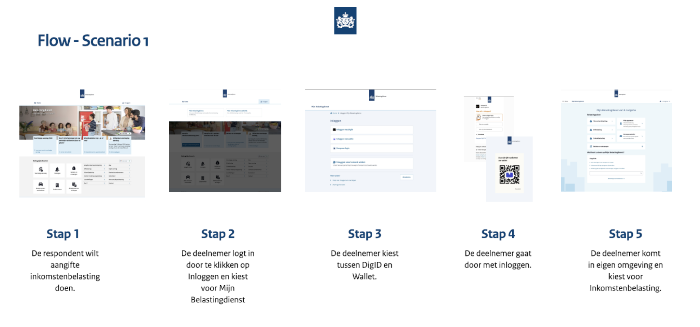

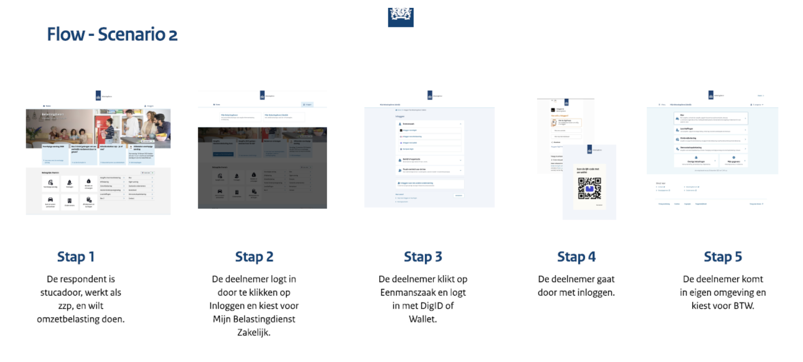

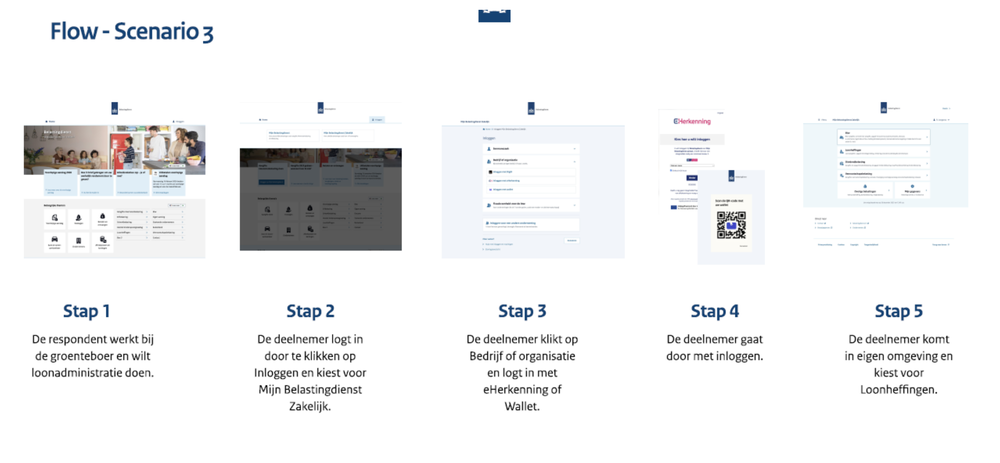

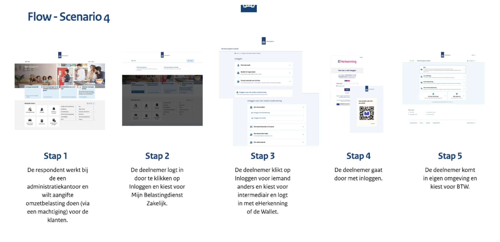

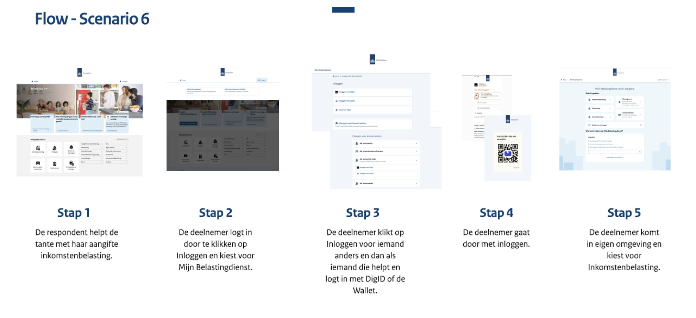

---

## Inloggen-flow met wallet v1.1

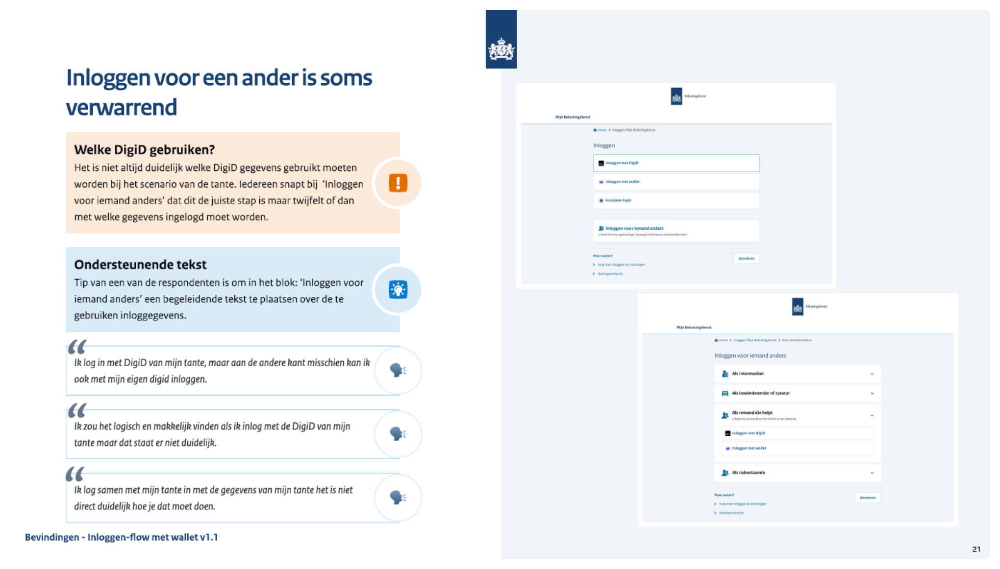

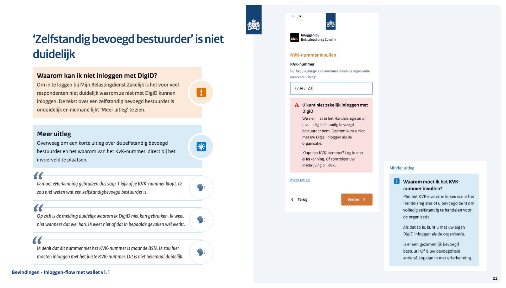

---

## Belastingdienst gebruikerstest Inloggen met DigiD

### Scenario’s A en B

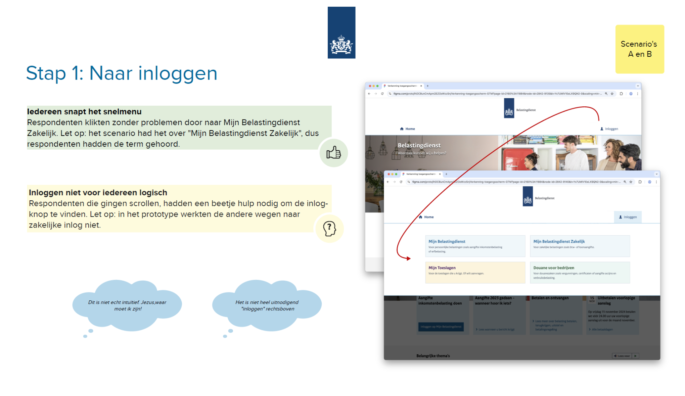

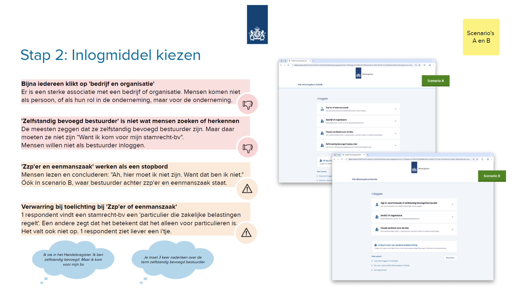

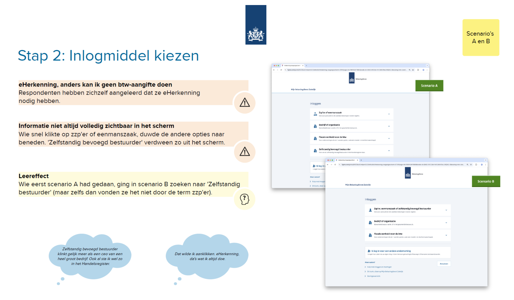

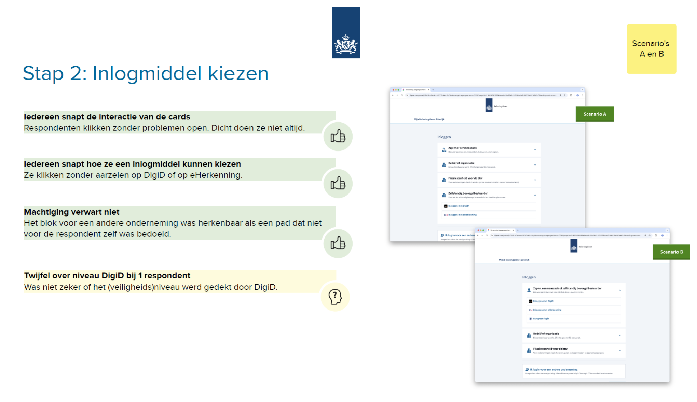

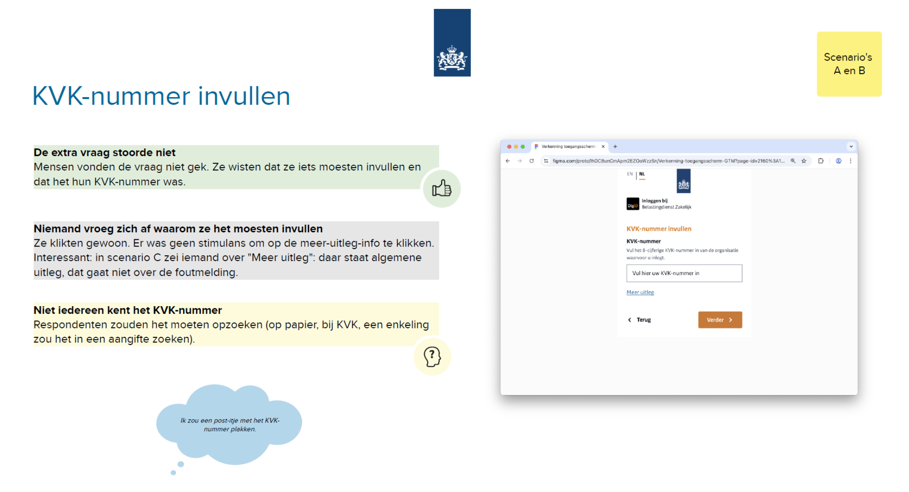

### Scenario D

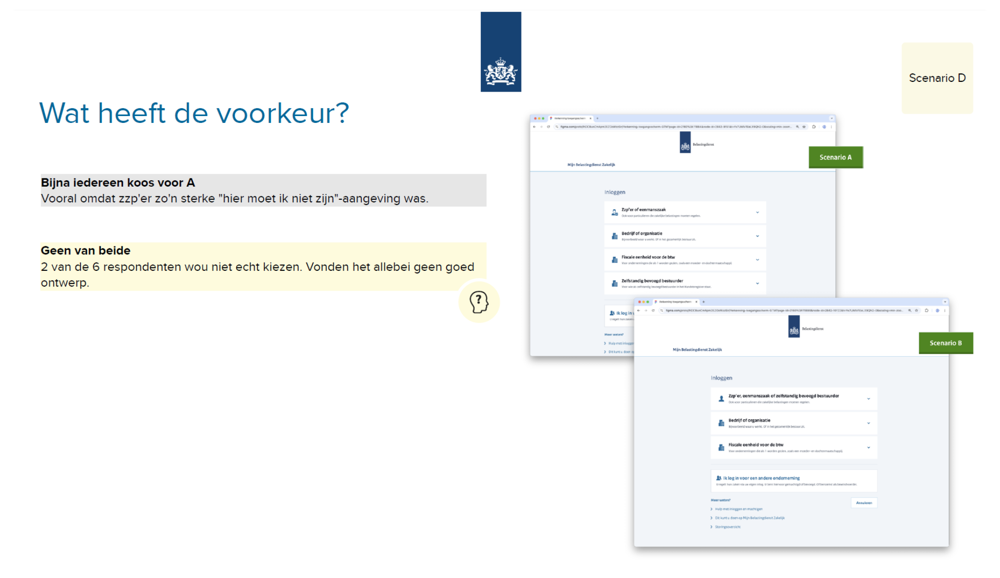

### Scenario E

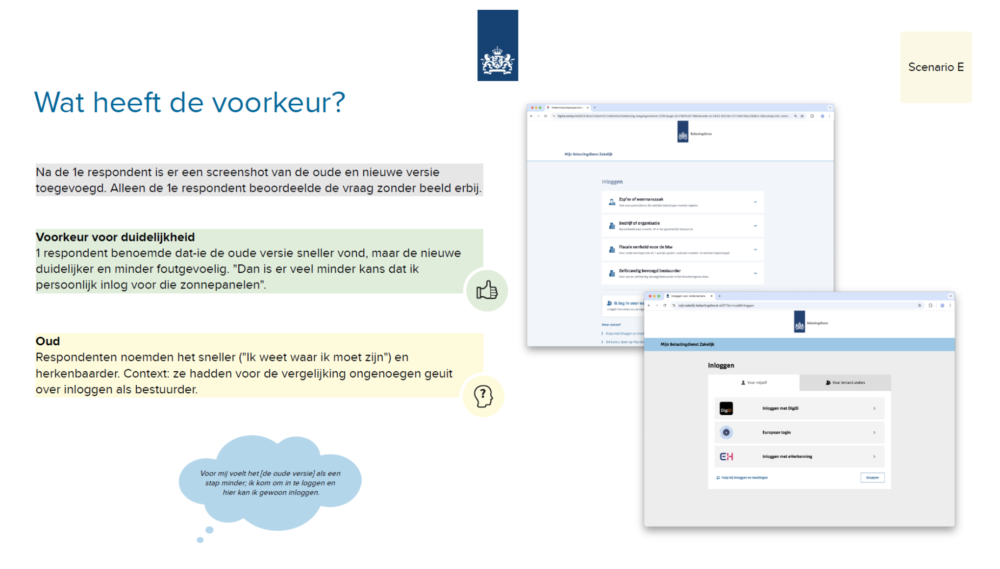

---

##  Belastingdienst Inloggen publiek zakelijk

### Beantwoording onderzoeksvraag

- De meeste deelnemers loggen probleemloos in met DigiD, maar waren dit al gewend.
- Het ontwerp begeleidt deelnemers die gewend zijn aan eHerkenning niet goed naar de nieuwe inlog-methode.
- Als deelnemers in de DigiD-flow zitten, identificeren ze zich met eenmanszaak (in geval van eenmanszaken met personeel) of met de optie over volledige tekenbevoegdheid. De keuze voor deze  laatste optie is negatief: ik ben geen zzp'er of eenmanszaak, dus ik moet dit kiezen.

### Verder onderzoeken

Kijk hoe je het nieuws over de nieuwe inlog naar buiten kunt brengen. Misschien is er ook een samenwerking met de Kamer van Koophandel mogelijk (nieuwsbrief, infopakket voor nieuwe ondernemers (met de juiste bedrijfsvorm)).

Onderzoek hoe je de gewoonte beter kan doorbreken.

Onderzoek of het duidelijker te maken valt voor wie eHerkenning dan is, of voor wie het nieuwe inlog-middel is (met nog herkenbaardere bedrijfsvormen of definities).

### Verder onderzoeken n.a.v. de gehele context rondom inloggen

Vrijwel alle respondenten maakten geen gebruik van de inlog-optie rechtsboven op het scherm, maar geven aan er normaal
gezien nooit last van te hebben. Ze gebruiken bookmarks of linkjes, of gaan via een andere weg.

Waarom hebben ze ooit die bookmark of link gemaakt, en kunnen wij ervoor zorgen dat dit niet nodig is?

Bekijk of je in Mijn Belastingdienst Zakelijk iets kan doen, of je mensen met de geschikte bedrijfsvorm die zijn ingelogd met eHerkenning kunt benaderen.

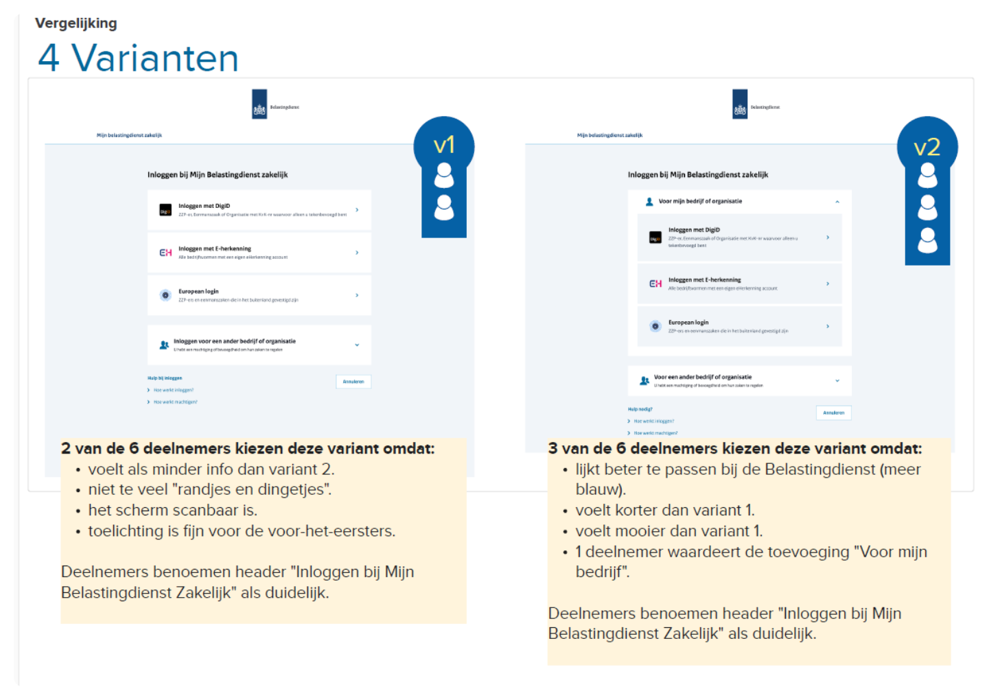

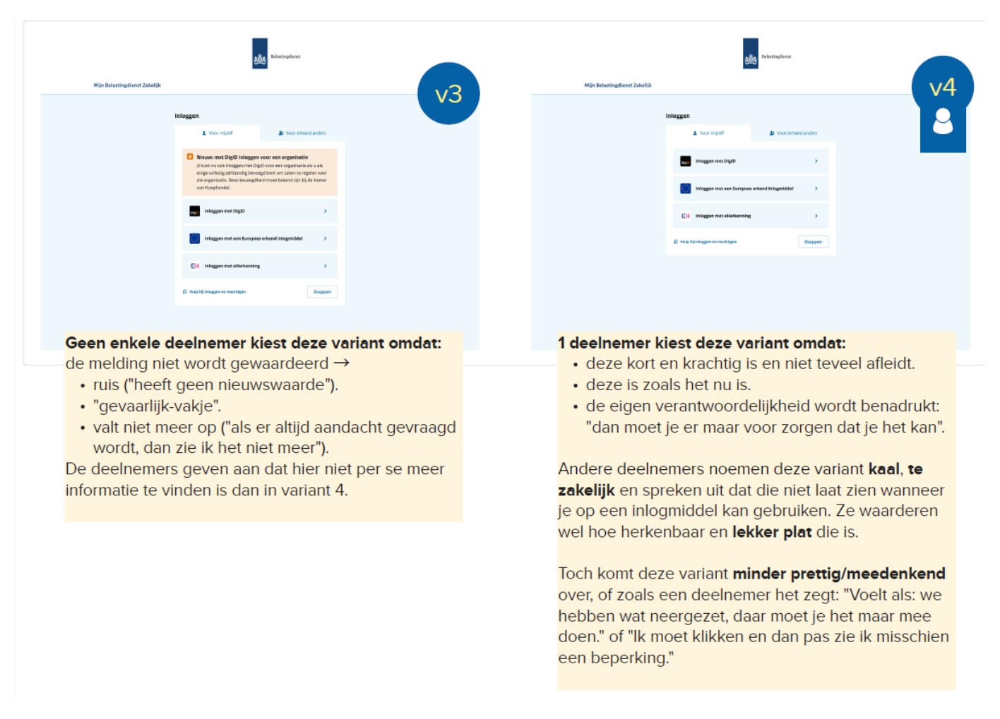

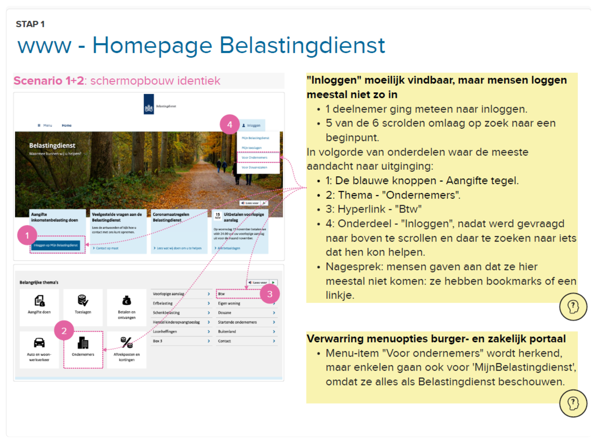

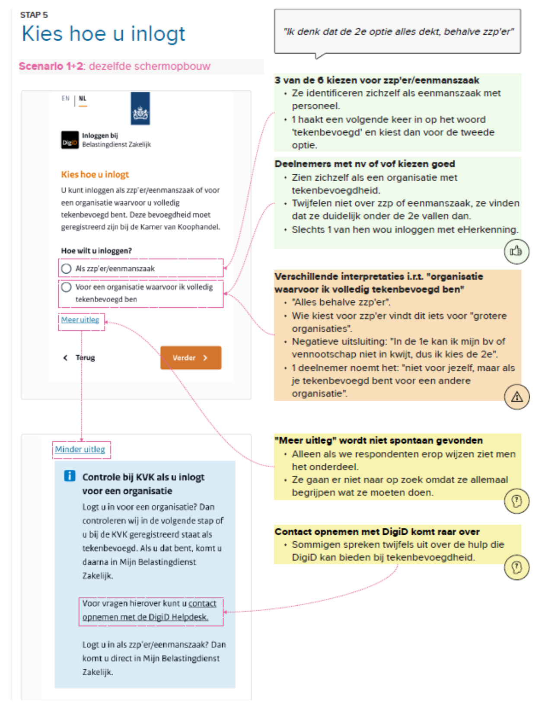

---

## 2023 Enquete: Behoeften KvK gegevens op MijnOverheid

Enquete onder 400 ondernemers en bestuursleden.

Top 5 KvK registraties per rechtsvorm:

- Eenmanszaken: 1.446.248 (=34%)
- BVs: 846.892 (=20%)
- Verenigingen (25% hiervan zijn VvEs ): 773.335 (=18%)
- Stichtingen: 699.355 (=16%)
- VoFs: 382.840 (=9%)

Standaard heeft elke vereniging en stichting een voorzitter en een
penningmeester, tenzij anders bepaald in de statuten.

### Over verenigingsbesturen

- Meestal deelname op vrijwillige basis
- Regelmatig bestuurswisselingen
- Gevolg: niet altijd op de hoogte van processen, juridische terminologie en kennis van zaken. Deel 'onbewust onbekwaam’.
- Ander deel soms al vele jaren in het bestuur. Ervaren bestuurders geven niet graag de touwtjes uit handen en zijn vaak wat ouder.

Zowel bestuursleden als ondernemers willen KvK gegevens zien op MijnOverheid.nl.   

- Als mensen **zowel ondernemer als bestuurder** zijn, vinden ze het zien van sommige KvK-gegevens op MijnOverheid significant belangrijker.
- Een deel, ongeveer **15%** wil hun KvK-gegevens **niet zien** op MijnOverheid. 
 
Redenen om de gegevens niet op MijnOverheid te willen zien:

- Dit heeft vooral te maken met privacy en het gevoel dat er op meerdere plekken dezelfde informatie wordt bewaard.
- Ook geven mensen aan dat ze gewend zijn aan het feit dat hun gegevens bij de Kamer van Koophandel staan en dat dat prima is.
- Men verwacht de KvK gegevens te vinden op MijnOverheid op een plek die binnen hun eigen context valt. Als men het niet met werk associeert, zal dat voor hen niet de eerste plek zijn waar zij de gegevens verwachten. Zo zien we bij alle drie de groepen de ingang 'Identiteit' terugkomen. (Ze koppelen hun rol aan hun identiteit).

**55% van ondernemers met een bestuursfunctie wil deze gegevens gescheiden houden.**

- De grootste groep ondernemers én bestuurders willen gegevens gescheiden houden (55%)
- 26% wil de gegevens bij elkaar zien
- 19% heeft geen voorkeur

Een deel van bestuursleden vindt vrijwilligerswerk geen werk en zou het dus niet onder WERK in Mo verwachten.

::: {.callout-usecase title="Use case 1"}
Ondernemer die ook voorzitter van tuinclub is en van de VvE.
:::

::: {.callout-usecase title="Use case 2"}
Zzp-er die VoF heeft.
:::

::: {.callout-usecase title="Use case 3"}
Burger die ook penningmeester is van vereniging.
:::

::: {.callout-usecase title="Use case 4"}
Ondernemer die ook belang heeft in een andere onderneming (UBO).
:::

::: {.callout-usecase title="Use case 5"}
Burger die ook in bestuur zit van vereniging. Vraag: mag je dan wel of niet inloggen?
:::

::: {.callout-usecase title="Use case 6"}
Startende ondernemer (die zich wil orienteren - maar zich nog niet heeft ingeschreven bij de KvK)
:::

::: {.callout-usecase title="Use case 7"}
Ondernemer uit EU wil zich in NL vestigen. Inloggen met buitenlands inlogmiddel (eIDAS?).
:::

::: {.callout-question title="Vraag"}
Gaan bestuursleden en/of stichtingen gebruik maken van MOZa?
:::

::: {.callout-question title="Vraag"}
Hoe zorg je dat nieuwe bestuursleden ook op de hoogte worden gebracht van bestaan MOZa, als dat een plek voor hen is?
:::

::: {.callout-note title="Wat is een VoF (bron KvK)"}
Als u gaat samenwerken met andere ondernemers onder één bedrijfsnaam kunt u samen een vof oprichten. U heeft daarvoor geen startkapitaal nodig. De onderlinge afspraken legt u vast in een vof-contract. Iedere deelnemer is privé aansprakelijk voor de hele vof.
:::

---

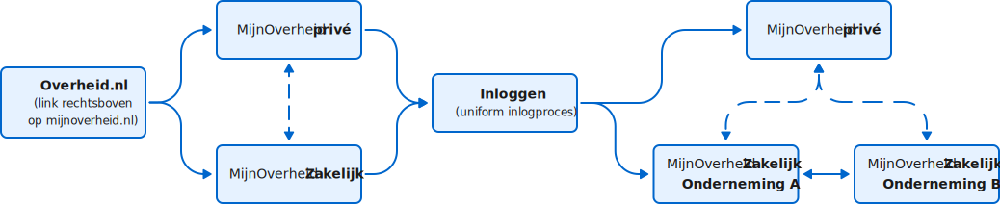

---

## Adviesrapport levensgebeurtenissen - Ik wil voor mezelf beginnen

::: {.callout-note title="Opmerking"}
Misschien of topic wat betreft inloggen. Maar wat betreft actualiteiten wel interessant.
:::

Een starter ervaart het beginnen van een onderneming als relatief eenvoudig. Echter, een gedeelte dat geregeld moet worden met de overheidsorganisaties is in het begin niet altijd duidelijk. Maar na enig zoekwerk online, navraag binnen het eigen netwerk en via KVK, begint de starter gewoon. De starter laat zich in het begin meevoeren door KVK en zorgt ervoor dat hij aan de minimale eisen voldoet om een KVK- + btw-nummer te ontvangen.

**Stilstaan bij gemeentelijke subsidiemogelijkheden, verordeningen en de ontwikkeling van intellectueel eigendom gebeurt weinig.** Dit lijken gemiste kansen en een serieus risico voor de starter in de toekomst. Kansen zitten in de **subsidiemogelijkheden en andere hulp die de gemeenten aan starters bieden**. Risico’s liggen in klachten van omwonenden en boetes voor het niet voldoen aan lokale wet- en regelgeving.

- De KvK heeft een voorinschrijving → impact op inloggen?
- Fouten in de 1e BTW aangifte komen vaak voor. Hoe dit te voorkomen?
- De ondernemer wil ondernemen! Hierdoor wordt er minder aandacht besteed aan het op de hoogte blijven van administratieve of wettelijke verplichtingen. Informatie uit het eigen netwerk wordt vaak gezien als voldoende.
- Aangezien ondernemers bij de verschillende overheidsloketten (KVK/Handelsregister, gemeente, Belastingdienst, merkenregister) dezelfde persoons- en bedrijfsgegevens moeten opgeven, is het logisch om deze onderling met elkaar te verbinden. Maar.... blijkt uit dit onderzoek dat starters geen klachten hebben over registratie en aantal handelingen in opstartfase.
- **KvK, Belastingdienst en Gemeente** zijn belangrijkste 'touchpoints' in opstartfase.

::: {.callout-userjourney}
Ik wil voor mezelf beginnen.
:::

---

## Gebruikersonderzoek prototype MijnOverheid Zakelijk (MOZa) augustus 2025

Onderzoek naar eerste prototype van MOZa-portaal als concept.

**Slechts één keer inloggen en daarna toegang hebben tot alle overheidsorganisaties** wordt door ondernemers gezien als het grootste voordeel. Bijna iedereen noemde dit als belangrijkste functionaliteit, omdat je in de huidige situatie constant opnieuw, en op verschillende manieren, moet inloggen bij verschillende overheidsorganisaties en dat geeft frustratie. Voor het inloggen gebruiken zij eHerkenning, DigiD of boekhoudsoftware en hechten naast gemak ook veel waarde aan veiligheid, zoals twee factorauthenticatie.

::: {.callout-quote title="Citaat MKB 10–30 medewerkers"}
Ik begin er niet eens aan als ik 22 keer moet inloggen.
:::

::: {.callout-quote title="Citaat MKB 10–30 medewerkers"}
Subsidieaanvraag doe ik met e-Herkenning en Belastingdienst met Digid.
:::

Op basis van het huidige prototype zijn de belangrijkste functionaliteiten voor ondernemers:
- slechts één keer inloggen, 
- wisselen tussen ondernemingen, en 
- een duidelijk overzicht van lopende zaken en statusupdates

Ook contacten communicatievoorkeuren spelen een belangrijke rol: ondernemers willen zelf bepalen via welk kanaal zij berichten ontvangen en wie binnen hun organisatie welke informatie mag zien. Hier zit ook een risico: te algemeen ingestelde rollen of machtigingen kunnen zorgen voor fouten of privacy-issues (bijvoorbeeld een accountant die boetes van een bedrijf te zien krijgt).

::: {.callout-requirement}
Eén keer inloggen voor toegang tot ál je overheidszaken.
:::

::: {.callout-requirement}
Eén keer inloggen om al je ondernemingen te zien. (Kunnen switchen tussen ondernemingen zonder opnieuw in te loggen.)
:::

::: {.callout-usecase}
Een ondernemer met meerdere ondernemingen (KvK inschrijvingen) moet snel uitkomen bij de juiste onderneming.
:::

### Bronnen

- [MOZa notificatieservice - Ontwerpend onderzoek: de belangrijkste inzichten (Samenwerkruimte)](https://www.samenwerkruimten.nl/teamsites/programma%20mijnoverheid%20voor%20ondernemers/Gedeelde%20%20documenten/03%20-%20Programma%20inhoudelijke%20documenten/01%20-%20Gebruikersonderzoeken%20en%20input/01%20-%20Onderzoeken/01%20-%20Juli%202025/Onderzoek%20inzichten%20MOZa%20(gesprekken%20met%20ZZP%27ers%20en%20MKB%27ers)_juli%202025_UX%20Research.pdf)

---

## Ontwerpend onderzoek: de belangrijkste inzichten (juli 2025)

In Q2 2025 zijn er 3 verkennende onderzoeken gedaan naar hoe ondernemers hun zaken op dit regelen en vooral hoe ze op de hoogte blijven van wat er moet gebeuren. Met 3 verschillende doelgroepen: ZZP, MKB tot 10 m/v personeel, MKB tot 30 M/V personeel.

### Pijnpunten

- Ondernemers moeten op veel verschillende plekken inloggen bij de overheid, wat verwarrend en tijdrovend is. 
- Inloggen met eHerkenning is duur en ingewikkeld, vooral bij meerdere BV’s of kleine ondernemingen.

### Behoeften

- Eenvoudige en uniforme digitale toegang

::: {.callout-quote title="MKB'er tot 50 medewerker"}
Als ik berichten moet lezen van de overheid, ben ik voor mijn gevoel 10 minuten kwijt door alleen al het inloggen.” – ZZP’er 
"Wat ik nu vervelend vind, is dat er voor elke dienst een andere manier van inloggen is, of andere drempels die worden opgelegd en het niet uniform gemaakt kan worden.
:::

### Bronnen

- [Gebruikersonderzoek prototype MijnOverheid Zakelijk (MOZa) 27 – 29 augustus 2025 (Samenwerkruimte)](https://www.samenwerkruimten.nl/teamsites/programma%20mijnoverheid%20voor%20ondernemers/Gedeelde%20%20documenten/03%20-%20Programma%20inhoudelijke%20documenten/01%20-%20Gebruikersonderzoeken%20en%20input/01%20-%20Onderzoeken/01%20-%20Aug%202025/Rapportage%20usability%20onderzoek%20inzichten%20MOZa%20(gesprekken%20met%20MKB%27ers)_augustus%202025_UX%20Research.pdf)

---

## Gebruikersonderzoek MOZa prototype - oktober 2025

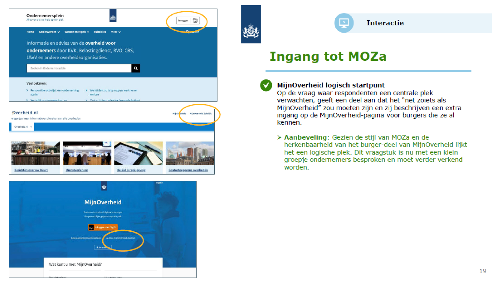

---

## Doel: Inzicht geven in inlogscenario’s (burger & ondernemer) om startpagina en CTA’s te ontwerpen

Er dient onderscheid te worden gemaakt tussen MijnOverheid als persoonlijke omgeving voor burgers en MijnOverheid Zakelijk als zakelijke omgeving voor ondernemers, organisaties en vertegenwoordigers die namens een organisatie handelen.

### Vragen:

- Hebben burgers last van dat linkje naar mijn overheid zakelijk?  
- Hoe kom je van overheid.nl als burger/ondernemers op een startpagina die voor jou relevant is? 

### Doelgroep

UX designers, 'gespreksartifact'.

### Output

10 use cases, einde van de middag. 

### Input

Bestaande onderzoeksrapporten + eigen inzichten/inschattingen van de UX researchers over gebruikers.

### Hypothese

Waarschijnlijk twee hoofdroutes, persoonlijk en namens organisatie, een individu heeft voldoende zelfherkenning om hierin een keuze te maken.

::: {.callout-caution}
Risico is wel dat bij mensen met meerdere petten en bij bestuurders van vereniging die zichzelf niet herkennen in alleen het woord “ondernemer” → iets om op te letten in de UX.
:::

### Bronnen

- [Logius | Stijlhandleiding aansluiten Toegang](https://www.logius.nl/onze-dienstverlening/toegang/stijlhandleiding-aansluiten-toegang)
- [Uniform inloggen (Figma)](https://www.figma.com/design/ITZNAyD8A5VyNsW0JGMm9o/Uniform-inloggen?node-id=63-2411&t=iA475WqWMLkUBPFn-1)
- G-schrijf enquetes MO KVK (2023)
- Belastingsdienst
- Zeewaardig onderzoek
- Machtigen, metaonderzoek

+--------------------+-----------------+------------------------------+----------------------------+-------------------------------------+
| Gebruikerstcontext | Handelt…        | Hoofdtaak/reden van inloggen | Huidige situatie startpunt | Verwachte startpunt(en)             |
+====================+=================+==============================+============================+=====================================+
| Burger             | privé           | Persoonlijke context,        | Hoofdroute:                | Hoofdroute:                         |
|                    |                 | eigen post,                  | [mijnoverheid.nl][1]       |                                     |
|                    |                 | eigen gegevens               |                            |                                     |
|                    |                 |                              | Subroute:                  | Subroute:                           |
|                    |                 | Verwacht MijnOverheid        | [overheid.nl][2]           |                                     |
|                    |                 | en DigiD                     |                            |                                     |
+--------------------+-----------------+------------------------------+----------------------------+-------------------------------------+
| Burger             | privé,          | Persoonlijke context         |                            |                                     |
|                    | namens een ander| van een ander,               |                            |                                     |
|                    |                 | eigen post,                  |                            |                                     |
|                    |                 | eigen gegevens.              |                            |                                     |
|                    |                 |                              |                            |                                     |
|                    |                 | Verwacht MijnOverheid        |                            |                                     |
|                    |                 | en DigiD.                    |                            |                                     |
+--------------------+-----------------+------------------------------+----------------------------+-------------------------------------+
| Burger met         | privé en        | Iemand kan privé-burger      |                            |                                     |
| meerdere petten    | zakelijk        | zijn en tegelijk             |                            |                                     |
|                    |                 | bestuurder, ondernemer       |                            |                                     |
|                    |                 | of gemachtigde.              |                            |                                     |
|                    |                 |                              |                            |                                     |
|                    |                 | Schakelt tussen              |                            |                                     |
|                    |                 | persoonlijke en              |                            |                                     |
|                    |                 | zakelijke context.           |                            |                                     |
+--------------------+-----------------+------------------------------+----------------------------+-------------------------------------+
| Ondernemer         | eigen bedrijf   |                              |                            |                                     |
+--------------------+-----------------+------------------------------+----------------------------+-------------------------------------+
| Werknemers van een | namens bedrijf  |                              |                            |                                     |
| ondernemer.        |                 |                              |                            |                                     |
+--------------------+-----------------+------------------------------+----------------------------+-------------------------------------+
| Intermediair       | namens klant    |                              |                            |                                     |
+--------------------+-----------------+------------------------------+----------------------------+-------------------------------------+
| Lid vereniging     | namens een      |                              |                            |                                     |
|                    | rechtspersoon   |                              |                            |                                     |
|                    | of bestuur      |                              |                            |                                     |
+--------------------+-----------------+------------------------------+----------------------------+-------------------------------------+

: Overzicht gebruikerscontexten

[1]: https://mijn.overheid.nl/
[2]: https://overheid.nl/

---

## Algemeen

::: {.callout-question}
(Ook m.b.t. Actualiteiten): Weten we eigenlijk wel voor welke informatie ondernemers willen inloggen?  Deze vraag ook goed meenemen in Actualiteiten onderzoek.
:::
